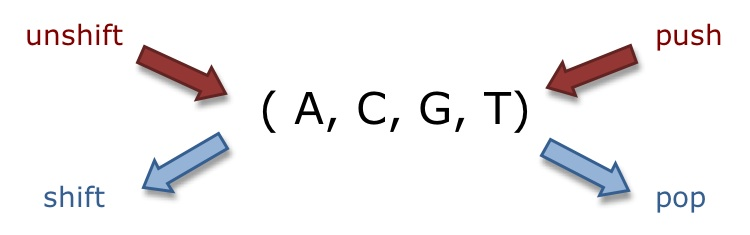

### Recently I've been working on a project where a customer asked to sort user inputs by various rules and be able to insert future forms at the beginning of the form.

So using shift and unshift sounded like the best idea - didn't you have problems remembering which one does what?

Lovely and easily explained:

Found this on: http://stackoverflow.com/questions/8073673/how-can-i-add-new-array-elements-at-the-beginning-of-an-array-in-javascript
